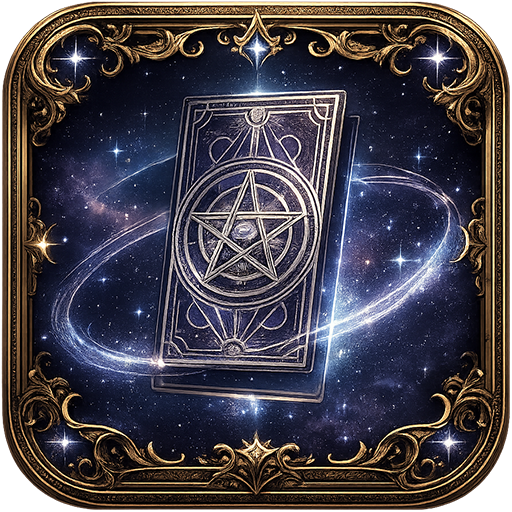
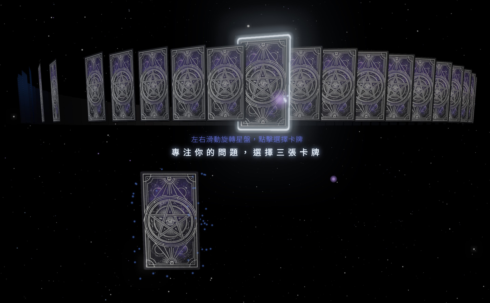
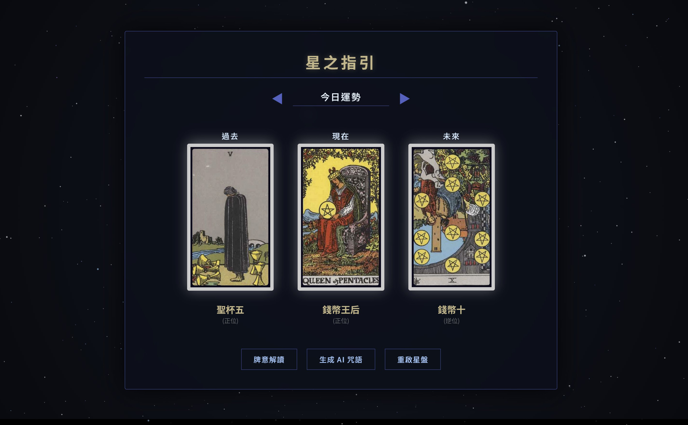

# 星光塔羅 Star Tarot

一個基於 Three.js 開發的 3D 沉浸式網頁塔羅牌應用。透過 WebGL 渲染星空場景、自定義的環境音效引擎與流暢的 3D 卡牌互動，完美模擬現實中洗牌、抽牌，提供有別於傳統平面的線上占卜體驗。



> **Demo 連結**：[https://misterp8.github.io/StarTarot/]



## 專案特色

* **真實物理抽牌與正逆位機制**：與一般點擊後才「亂數決定」結果的算命網頁不同。在星盤初始化時，即透過 Fisher-Yates shuffle 洗牌演算法完成 78 張牌的打亂，並在 3D 空間中賦予每一張牌獨立的座標與預先決定的「正逆位」狀態。你所點擊選中的，就是空間中真正存在於那個位置的牌。完美模擬現實中洗牌、展牌與抽牌的物理隨機性，讓能量的連結與占卜結果更加真實且準確。
* **內建基礎牌意解說**：系統內建完整的 78 張塔羅牌資料庫。選牌後可直接開啟基本牌意解讀，查看針對「全面、今日運勢、愛情、事業、財務、健康、抉擇」等不同領域的專屬正位與逆位解析，即可獲得基本指引。
* **3D 互動星盤**：使用 Three.js 打造 78 張卡牌的環狀星盤。支援電腦版滑鼠拖曳與行動裝置的觸控滑動選牌。
* **沉浸式視覺特效**：
  * 使用 Post-processing (Bloom 泛光、FXAA 抗鋸齒) 提升畫面質感。
  * 自定義粒子系統 (星空背景、滑鼠軌跡火花、卡牌選取精靈粉塵)。
* **原生環境音效引擎**：不依賴外部音檔，全由 Web Audio API 動態生成的環境白噪音、殘響 (Reverb) 與合成音效 (Hover, Click, Reveal)。
* **行動裝置最佳化**：
  * 實作 Landscape Lock (橫向模式強制提醒)。
  * 針對手機版觸控優化的 UI/UX 與專屬的左右滑動手勢提示。
* **AI 解牌整合**：內建 Prompt 產生器，根據使用者抽出的三張牌（過去、現在、未來）與正逆位，一鍵生成適合給 ChatGPT / Gemini 的專業占卜咒語。
* **客製化外觀**：支援多種塔羅牌背 (Skin) 即時切換。

## 技術

* **前端核心**：HTML5, CSS3, Vanilla JavaScript (ES6 Modules)
* **3D 渲染**：[Three.js](https://threejs.org/) (v0.160.0)
* **動畫引擎**：Tween.js
* **音訊處理**：Web Audio API
* **PWA 支援**：內建 `manifest.json` 支援安裝至手機桌面

## 本地端開發與執行

因專案使用 ES6 Modules (`type="module"`) 以及載入本地端材質與圖片，直接點擊 `index.html` 會遇到 CORS 跨網域限制。請透過本地伺服器來執行：

**方法一：使用 VSCode (推薦)**
1. 在 VSCode 開啟此專案資料夾。
2. 安裝 [Live Server](https://marketplace.visualstudio.com/items?itemName=ritwickdey.LiveServer) 擴充套件。
3. 右鍵點擊 `index.html`，選擇 "Open with Live Server"。

**方法二：使用 Node.js**
如果你有安裝 Node.js，可以使用 `http-server` 或 `serve`：
```bash
npx http-server .
```

**方法三：使用 Python**
```bash
python -m http.server 8000
```
然後在瀏覽器開啟 `http://localhost:8000`。

## 目錄結構

```text
/
├── index.html          # 主頁面結構與 UI
├── style.css           # 樣式表、RWD 與 CSS 動畫
├── script.js           # 核心邏輯 (Three.js 場景、互動、音效、選牌機制)
├── manifest.json       # PWA 設定檔
├── card_meanings1.js   # 牌義資料庫 1 (預設)
├── card_meanings2.js   # 牌義資料庫 2 (隨機切換用)
├── card_meanings3.js   # 牌義資料庫 3 (隨機切換用)
└── cards/              # 塔羅牌面圖檔與牌背材質
```

## 支持

如果你喜歡星光塔羅，覺得準的話，歡迎請我喝杯咖啡！ ☕

<a href="https://buymeacoffee.com/mister.p" target="_blank">
  

</a>
